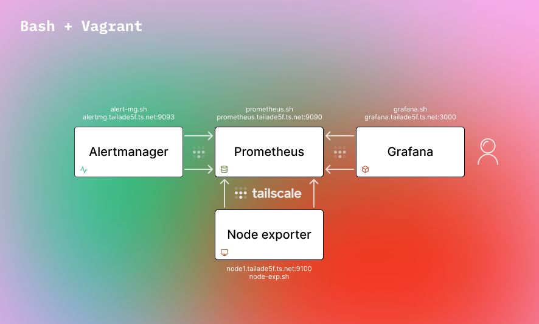

# PAG
<!---
💚❤️ :octocat:
--->

| :octocat: | Task |
| --- | --- |
| 💛 | Bash-скрипти |
| ❤️ | Docker compose |
| ❤️ | Ansible playbook |
| ❤️ | Автоматизація Jenkins |
| ❤️ | Vagrant / Terraform |

<picture>
    <source media="(prefers-color-scheme: dark)" srcset="./images/1b.png">
    
</picture>

> [!TIP]
> Edit the Bash scripts according to your preferences.